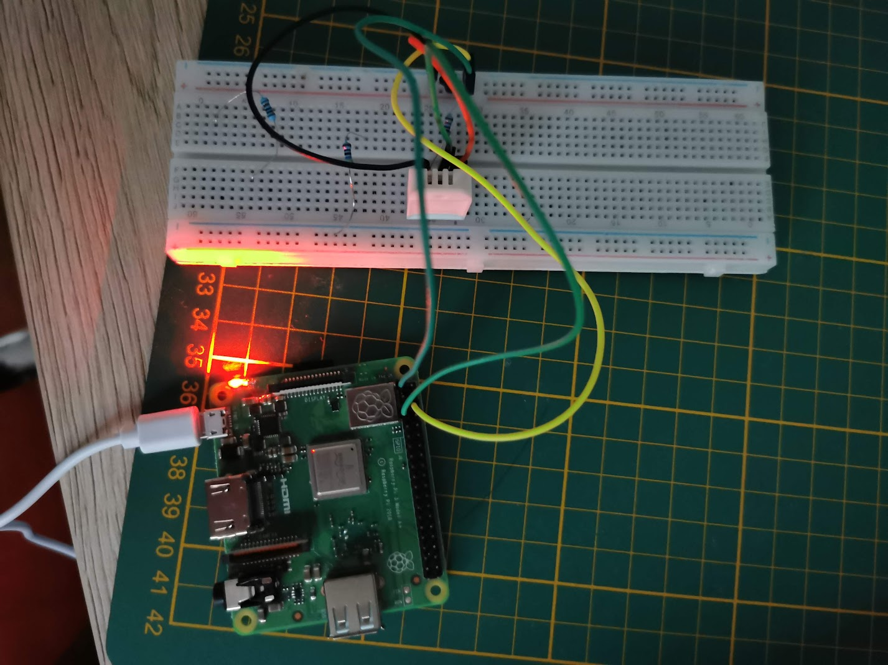
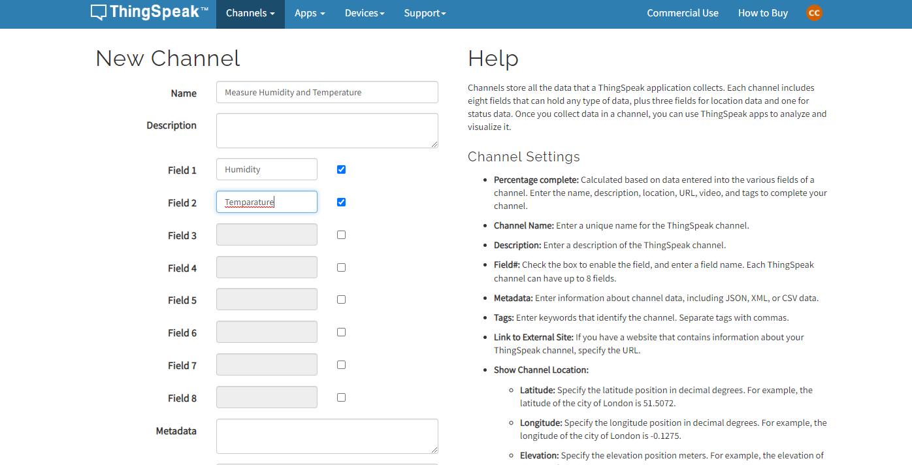
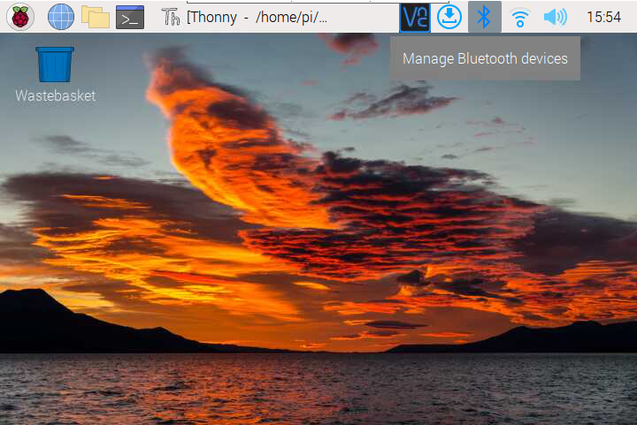
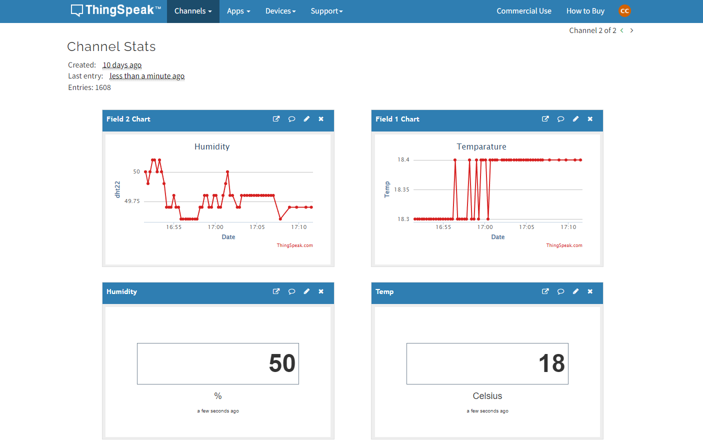
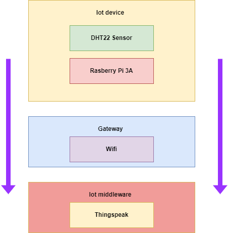

# Measure Humidity and Temperature with Raspberry Pi 3A and DHT22 sensor

Frequently, a lot of data is generated in projects that run around the clock. One way to store them permanently is to store the data in a local database. However, there are also some reasons that speak against it. In order to keep the measured data (for example, from a weather station) available in the future, it is also possible to avoid various online services. One of these providers is ThingSpeak. In this project we're gonna measure the humidity and temprature then log it in a cloud via an API.

## Setting up thingspeak account
Before we start, you need an account at ThingSpeak. Create an account on this link https://thingspeak.com/login if you do not have one yet. Then, create a new channel at https://thingspeak.com/channels.


now make channel with two fields humidty and temparature.



## Setting up rasberry pi 
First you have to flash your SD card. To download the rasbian OS visit this link https://www.raspberrypi.com/software/ 
After flashing the SD card, make two new files SSH and wpa_supplicant.config , in the wpa_supplicant.config file it should be filled with this:
```
country=US # Your 2-digit country code
ctrl_interface=DIR=/var/run/wpa_supplicant GROUP=netdev
network={
    ssid="YOUR_NETWORK_NAME"
    psk="YOUR_PASSWORD"
    key_mgmt=WPA-PSK
}

```
Put the two files in the SD card and then insert into the raspberry pi.
Now open putty on your laptop and enter the IP adress of the raspberry pi in the hostname with connectype SSH, you can find the IP adress of the raspberry pi with Angry IP Scanner https://angryip.org/


And now the login info for first time loggin:
```
username: pi
password: raspberry
```
and now we have to enable VNC so the we can stream the GUI on your laptop instead of using HDMI to plug in a monitor. with the command 

```
sudo raspi-config
```


With VNC enabled we can now use the laptop as a monitor. 


## Setting up DHT22 sensor 

I made a fritzing diagram of the setup, the resistor is 10k. 


All you need is 

- 4 jumper wires
- 1 raspberry pi
- 1 DHT22 sensor
- 1 10k resistor

## Making it work 

Open vnc and connect to your raspberry, now create a python file in the terminal with 
```
nano measure.py 
```
Download the necessary libraries with 

```
pip install thingspeak
pip install Adafruit_DHT
```

copy and paste this the code below

```
import thingspeak
import time
import Adafruit_DHT
 
channel_id = 1638044 # PUT CHANNEL ID HERE
write_key  = 'IQG6W5WX61USIYRA' # PUT YOUR WRITE KEY HERE
pin = 4
sensor = Adafruit_DHT.DHT22
 
def measure(channel):
    try:
        humidity, temperature = Adafruit_DHT.read_retry(sensor, pin)
        # write
        response = channel.update({'field1': temperature, 'field2': humidity})
        
        # read
        read = channel.get({})
        print("Read:", read)
        
    except:
        print("connection failed")
 
 
if __name__ == "__main__":
    channel = thingspeak.Channel(id=channel_id, api_key=write_key)
   
    while True:
        measure(channel)
        # free account has an api limit of 15sec
        time.sleep(15)
 ```
 
save it and then run it. (Note: the only thing you have to change is the channel id and write key to your own channel's id and write key.)
Now you can look at your thingspeak channel and analyze the data.


This is the data pipline for the project. 


